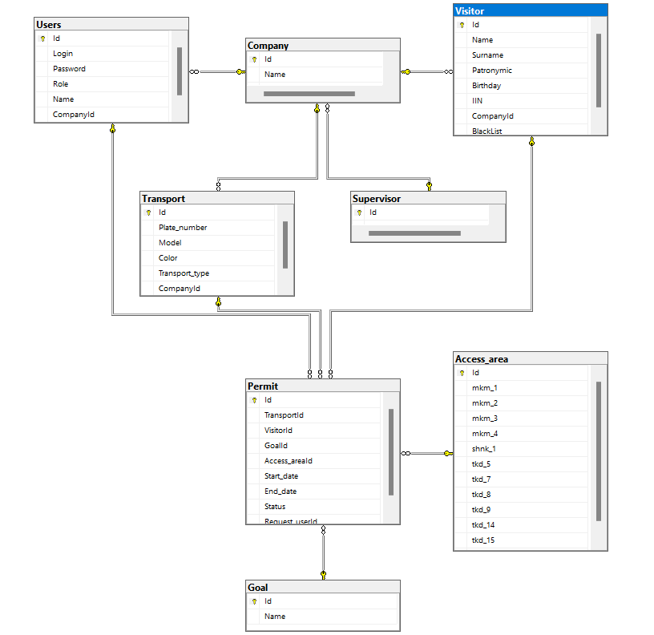

# В этом файле будет описан процесс создания и функционирования базы данных приложения

# База данных будет разворачиваться на сервере MSSQL

## Скрипт создания базы данных
```sql
CREATE database Permit_web_app 
```

# Структура базы данных
База данных будет состоять из следующих таблиц:
- "Company" - таблица с компаниями-подрядчиками
- "Visitor" - таблица с данными о посетителях
- "Supervisor" - таблица с данными кураторах подрядчиков
- "Access_area" - таблица с данными о зонах доступа
- "Goal" - таблица с данными о целях посещения
- "Users" - таблица с данными о пользователях системы
- "Transport" - таблица с данными о транспорте
- "Permit" - таблица с данными о пропусках


# Структура таблицы "Supervisor"
| Поле | Тип данных | Описание |
| --- | --- | --- |
| Id | int | Идентификатор куратора |
| Name | nvarchar(50) | Имя Дирекции |

# Скрипт создания таблицы "Supervisor"
```sql
IF OBJECT_ID('Supervisor', 'U') IS NULL
CREATE TABLE Supervisor (
    Id int IDENTITY (1,1) NOT NULL PRIMARY KEY,
    Name nvarchar(15) NOT NULL
)
```

# Структура таблицы "Company"
| Поле | Тип данных | Описание |
| --- | --- | --- |
| Id | int | Идентификатор компании |
| Name | nvarchar(50) | Название компании |
| SupervisorId | int | Идентификатор куратора компании |

# Скрипт создания таблицы "Company"
```sql 
IF OBJECT_ID('Company', 'U') IS NULL
CREATE TABLE Company (
    Id int IDENTITY (1,1) NOT NULL PRIMARY KEY,
    Name nvarchar(50) NOT NULL,
    SupervisorId int NOT NULL FOREIGN KEY REFERENCES Supervisor(Id)
)
```
# Структура таблицы "Visitor"
| Поле | Тип данных | Описание |
| --- | --- | --- |
| Id | int | Идентификатор посетителя |
| Name | nvarchar(50) | Имя посетителя |
| Surname | nvarchar(50) | Фамилия посетителя |
| Patronymic | nvarchar(50) | Отчество посетителя |
| Birthday | date | Дата рождения посетителя |
|IIN | nvarchar(12) | ИИН посетителя |
| CompanyId | int | Идентификатор компании, в которой работает посетитель |
| BlackList | bit | Признак нахождения посетителя в черном списке |

# Скрипт создания таблицы "Visitor"
```sql
IF OBJECT_ID('Visitor', 'U') IS NULL
CREATE TABLE Visitor (
    Id int IDENTITY (1,1) NOT NULL PRIMARY KEY,
    Name nvarchar(50) NOT NULL,
    Surname nvarchar(50) NOT NULL,
    Patronymic nvarchar(50),
    Birthday date,
    IIN nvarchar(12) NOT NULL,
    CompanyId int NOT NULL FOREIGN KEY REFERENCES Company(Id),
    BlackList bit NOT NULL DEFAULT 0
)
```

```
# Структура таблицы "Goal"

| Поле | Тип данных | Описание |
| --- | --- | --- |
| Id | int | Идентификатор цели посещения |
| Name | nvarchar(50) | Название цели посещения |

# Скрипт создания таблицы "Goal"
```sql
IF OBJECT_ID('Goal', 'U') IS NULL
CREATE TABLE Goal (
    Id int IDENTITY (1,1) NOT NULL PRIMARY KEY,
    Name nvarchar(50) NOT NULL
)
```
# Cтруктура таблицы "Users"

| Поле | Тип данных | Описание |
| --- | --- | --- |
| Id | int | Идентификатор пользователя |
| Login | nvarchar(50) | Логин пользователя |
| Password | nvarchar(50) | Пароль пользователя |
| Role | nvarchar(50) | Роль пользователя |
| Name | nvarchar(50) | Имя пользователя |
|CompanyId | int | Идентификатор компании, в которой работает пользователь |

# Скрипт создания таблицы "Users"
```sql
IF OBJECT_ID('Users', 'U') IS NULL
CREATE TABLE Users (
    Id int IDENTITY (1,1) NOT NULL PRIMARY KEY,
    Login nvarchar(50) NOT NULL,
    Password nvarchar(50) NOT NULL,
    Role nvarchar(50) NOT NULL,
    Name nvarchar(50) NOT NULL,
    CompanyId int NOT NULL FOREIGN KEY REFERENCES Company(Id)
)
```
# Структура таблицы "Transport"

| Поле | Тип данных | Описание |
| --- | --- | --- |
| Id | int | Идентификатор транспорта |
| Plate_number | nvarchar(15) | Номер транспорта |
| Model | nvarchar(15) | Модель транспорта |
| Color | nvarchar(15) | Цвет транспорта |
| Transport_type | nvarchar(15) | Тип транспорта |
| CompanyId | int | Идентификатор компании-владельца транспорта |

# Скрипт создания таблицы "Transport"
```sql
IF OBJECT_ID('Transport', 'U') IS NULL
CREATE TABLE Transport (
    Id int IDENTITY (1,1) NOT NULL PRIMARY KEY,
    Plate_number nvarchar(15) NOT NULL,
    Model nvarchar(15) NOT NULL,
    Color nvarchar(15),
    Transport_type nvarchar(15),
    CompanyId int NOT NULL FOREIGN KEY REFERENCES Company(Id)
)
```
# Структура таблицы "Permit"

| Поле | Тип данных | Описание |
| --- | --- | --- |
| Id | int | Идентификатор пропуска |
| TransportId | int | Идентификатор транспорта, для которого выдан пропуск |
| VisitorId | int | Идентификатор водителя, для которого выдан пропуск |
| GoalId | int | Идентификатор цели посещения |
| Access_areaId | int | Идентификатор зоны доступа |
| Start_date | datetime | Дата начала действия пропуска |
| End_date | datetime | Дата окончания действия пропуска |
| Status | bit | Признак статуса пропуска |
| Request_userId | int | Идентификатор пользователя, который запросил пропуск |

# Структура таблицы "Access_area"

| Поле | Тип данных | Описание |
| --- | --- | --- |
| Id | int | Идентификатор зон доступа |
| mkm_1 | bit | Признак доступа в зону mkm_1 |
| mkm_2 | bit | Признак доступа в зону mkm_2 |
| mkm_3 | bit | Признак доступа в зону mkm_3 |
| mkm_4 | bit | Признак доступа в зону mkm_4 |
| shnk_1 | bit | Признак доступа в зону shnk_1 |
| tkd_5 | bit | Признак доступа в зону tkd_5 |
| tkd_7 | bit | Признак доступа в зону tkd_7 |
| tkd_8 | bit | Признак доступа в зону tkd_8 |
| tkd_9 | bit | Признак доступа в зону tkd_9 |
| tkd_14 | bit | Признак доступа в зону tkd_14 |
| tkd_15 | bit | Признак доступа в зону tkd_15 |
| poly | bit | Признак доступа в зону poly |

# Скрипт создания таблицы "Access_area"
```sql
IF OBJECT_ID('Access_area', 'U') IS NULL
CREATE TABLE Access_area (
    Id int IDENTITY (1,1) NOT NULL PRIMARY KEY,
    mkm_1 bit NOT NULL DEFAULT 0,
    mkm_2 bit NOT NULL DEFAULT 0,
    mkm_3 bit NOT NULL DEFAULT 0,
    mkm_4 bit NOT NULL DEFAULT 0,
    shnk_1 bit NOT NULL DEFAULT 0,
    tkd_5 bit NOT NULL DEFAULT 0,
    tkd_7 bit NOT NULL DEFAULT 0,
    tkd_8 bit NOT NULL DEFAULT 0,
    tkd_9 bit NOT NULL DEFAULT 0,
    tkd_14 bit NOT NULL DEFAULT 0,
    tkd_15 bit NOT NULL DEFAULT 0,
    poly bit NOT NULL DEFAULT 0
)
```

# Скрипт создания таблицы "Permit"
```sql
IF OBJECT_ID('Permit', 'U') IS NULL
CREATE TABLE Permit (
    Id int IDENTITY (1,1) NOT NULL PRIMARY KEY,
    TransportId int NOT NULL FOREIGN KEY REFERENCES Transport(Id),
    VisitorId int NOT NULL FOREIGN KEY REFERENCES Visitor(Id),
    GoalId int NOT NULL FOREIGN KEY REFERENCES Goal(Id),
    Access_areaId int NOT NULL FOREIGN KEY REFERENCES Access_area(Id),
    Start_date datetime NOT NULL,
    End_date datetime NOT NULL,
    Status bit NOT NULL DEFAULT 0,
    Request_userId int NOT NULL FOREIGN KEY REFERENCES Users(Id)
)
```
# Диаграмма базы данных




